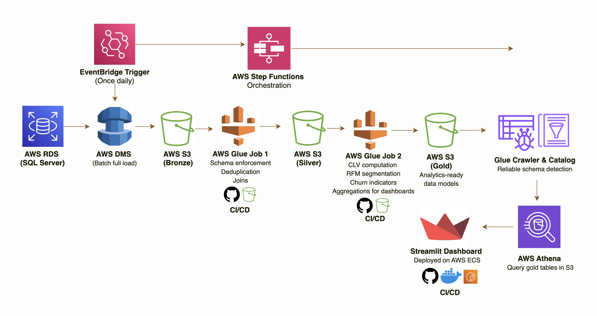

# globalpartners-analytics

# GlobalPartners Order Analytics — End-to-End AWS Data Pipeline

> [Watch Project Walkthrough](https://youtu.be/_09hr0gpkBY)

An end-to-end data engineering pipeline that ingests multi-location restaurant order data from SQL Server, transforms it through a medallion architecture (Bronze → Silver → Gold), and serves business intelligence metrics via an interactive Streamlit dashboard — deployed on AWS ECS Fargate.

Built entirely on AWS using PySpark, AWS Glue, S3, Athena, Step Functions, and GitHub Actions CI/CD.

---

## Architecture

> 
> *(See [`docs/architecture.md`](docs/architecture.md) for the full component breakdown and design rationale)*

---

## Tech Stack

| Layer | Technology |
|---|---|
| Source | SQL Server (AWS RDS — Express Edition) |
| Ingestion | AWS Database Migration Service (DMS) |
| Storage | AWS S3 (Bronze / Silver / Gold) |
| Transformation | AWS Glue (PySpark) |
| Orchestration | AWS Step Functions + Amazon EventBridge |
| Query Layer | AWS Athena + Glue Crawler & Catalog |
| Serving | Streamlit on AWS ECS Fargate (via ALB) |
| Secrets & Encryption | AWS KMS (SSE-KMS) |
| CI/CD | GitHub Actions |
| Version Control | GitHub |

> → Full component breakdown & design rationale: [`docs/architecture.md`](docs/architecture.md)

---

## Data Model

| Table | Description |
|---|---|
| `customer_intelligence` | One row per customer — RFM scores, CLV tier, churn status, segment |
| `customer_rolling_metrics` | One row per customer per order date — running cumulative CLV over time |
| `location_sales_trends` | Daily revenue and order counts by restaurant and item category |
| `loyalty_roi_analysis` | Aggregated spend and repeat rate comparison by loyalty membership status |
| `discount_effectiveness` | Revenue and AOV comparison between discounted and full-price orders |

> → Full data model with column definitions and calculation logic: [`docs/data-model.md`](docs/data-model.md)

---

## Quick Start

> → Full documentation of the project process, decisions, and roadblocks: [`docs/project-log.md`](docs/project-log.md)

### Prerequisites

- AWS Account with permissions for RDS, DMS, S3, Glue, Athena, Step Functions, ECS, ECR, EventBridge, KMS
- Python 3.11+
- Docker Desktop
- AWS CLI configured locally
- Azure Data Studio (for initial SQL Server data load)

### 1. Clone the repo

```bash
git clone https://github.com/YOUR_USERNAME/globalpartners-analytics.git
cd globalpartners-analytics
```

### 2. Set up the source database

Create an AWS RDS instance (SQL Server). Load the three source CSV files using Azure Data Studio:
- `order_items`
- `order_item_options`
- `date_dim`

Verify the database is in **FULL** recovery mode:

```sql
SELECT name, recovery_model_desc
FROM sys.databases
WHERE name = 'globalpartners';
-- Must return: FULL
```

> ⚠️ **Note:** SQL Server Express Edition does **not** support CDC. This pipeline uses a **Full Load** strategy via DMS. See [`docs/project-log.md`](docs/project-log.md) for the full context on this decision.

### 3. Configure KMS Encryption

Create a KMS key with alias `globalpartners-datalake-kms` and grant access to your DMS role, Glue role, Athena, and CloudWatch.

### 4. Run DMS Full Load

Create a DMS replication task targeting your S3 Bronze bucket (`globalpartners-bronze`). Data lands as Parquet files partitioned by date.

### 5. Deploy Glue Jobs

Glue scripts live in [`scripts/`](scripts/) and are deployed to S3 via GitHub Actions CI/CD on push to `main`.

Manually trigger or let EventBridge + Step Functions handle orchestration:

```
EventBridge (daily 7AM) → DMS Task → Step Functions → Glue Job 1 → Glue Job 2 → Glue Crawler → Athena
```

### 6. Run the Streamlit dashboard locally

```bash
pip install -r requirements.txt
streamlit run app.py
```

### 7. Deploy to ECS Fargate

```bash
# Build and push Docker image to ECR
aws ecr get-login-password --region us-east-1 | docker login --username AWS --password-stdin <YOUR_ACCOUNT_ID>.dkr.ecr.us-east-1.amazonaws.com

docker build --platform linux/amd64 -t global-partners-dashboard .
docker tag global-partners-dashboard:latest <YOUR_ACCOUNT_ID>.dkr.ecr.us-east-1.amazonaws.com/global-partners-dashboard:latest
docker push <YOUR_ACCOUNT_ID>.dkr.ecr.us-east-1.amazonaws.com/global-partners-dashboard:latest
```

Then deploy via ECS Fargate with an Application Load Balancer for a stable public URL.

---

## CI/CD

| Component | Method |
|---|---|
| Glue Job 1 & 2 | GitHub Actions → S3 sync → `aws glue update-job` on push to `main` (paths: `scripts/**`) |
| Streamlit Dashboard | GitHub Actions → Docker build → ECR push → ECS task definition update on push to `main` |

**Required GitHub Secrets:**

```
AWS_ACCESS_KEY_ID
AWS_SECRET_ACCESS_KEY
```

---

## Linked Repositories

| Repo | Purpose |
|---|---|
| [`global-partners-etl`](https://github.com/YOUR_USERNAME/global-partners-etl) | PySpark Glue Job scripts + ETL CI/CD workflow |
| [`global-partners-dashboard`](https://github.com/YOUR_USERNAME/global-partners-dashboard) | Streamlit app + Dockerfile + ECS CI/CD workflow |

---

## Docs

- [Architecture & Design Rationale](docs/architecture.md)
- [System Design Decisions](docs/system-design.md)
- [Data Model](docs/data-model.md)
- [Project Log](docs/project-log.md)
- [Pipeline Setup Guide](docs/pipeline-setup.md)
